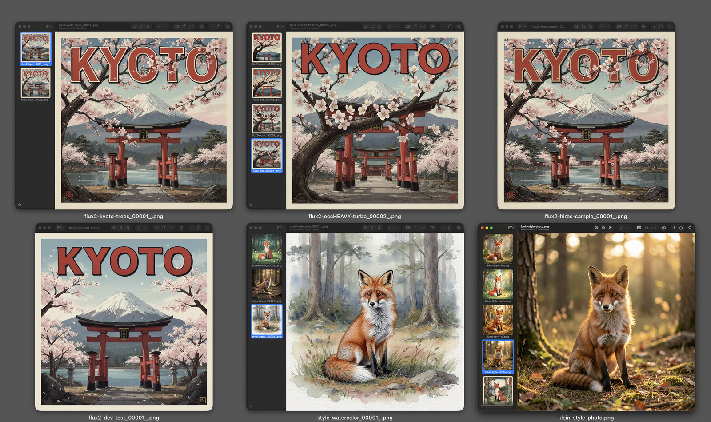
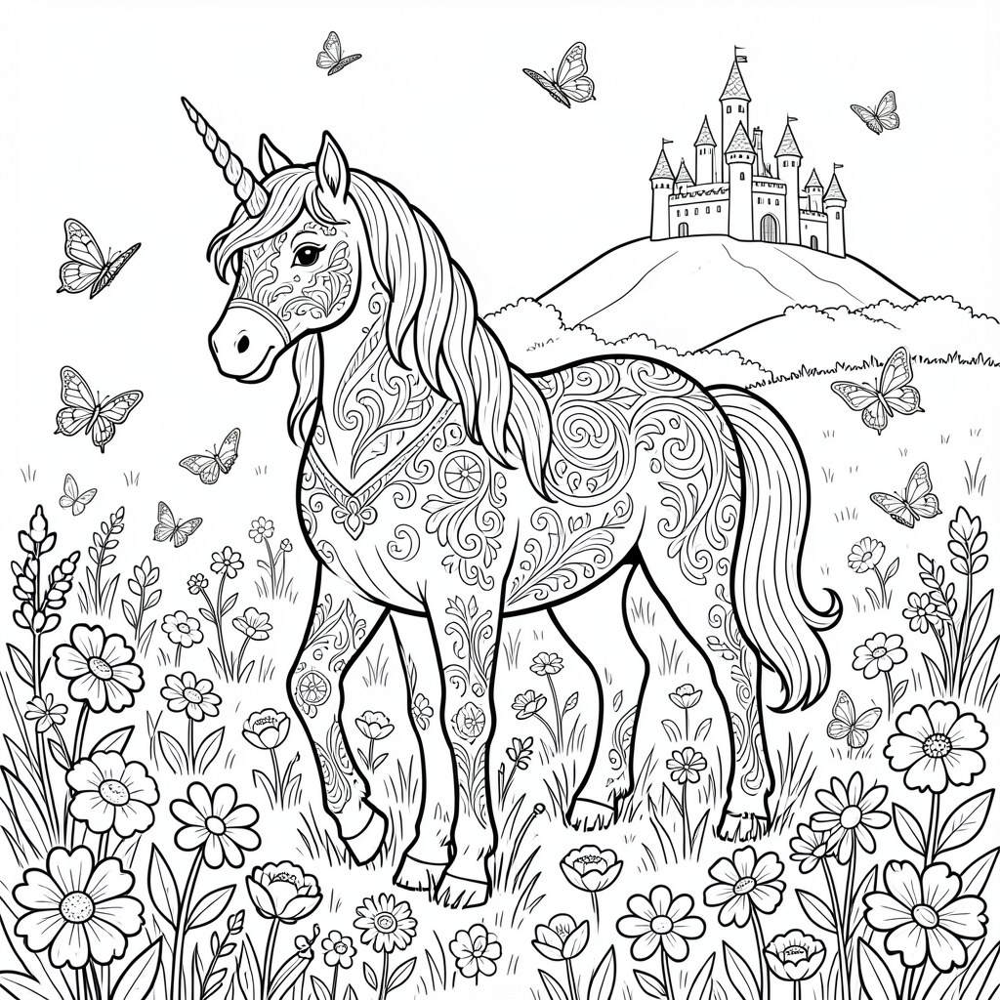
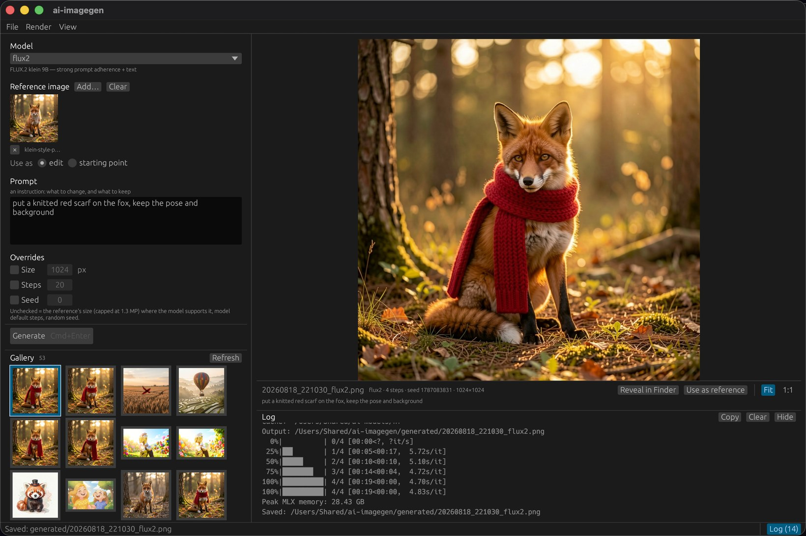

# AI Image Generation


[](https://github.com/whiskey/ai-imagegen/actions/workflows/ci.yml)
[](LICENSE)

Local image generation on Apple Silicon (**M5 Max, 64 GB**), two ways:

- **[MFLUX](https://github.com/filipstrand/mflux)** — native MLX, command-line, fastest. Z-Image, FLUX.2 [klein], Qwen-Image, FLUX.1.
- **[ComfyUI](https://github.com/comfyanonymous/ComfyUI)** — node UI for workflows, LoRAs, FLUX.2 [dev] 32B, and the pixel-art pipeline.

Everything is isolated (no system-wide Python) and every tool shares **one model
store** (`~/ai-models/`) so weights download once. Runs natively on Metal/MPS.

## Quick start

```bash
./generate.sh "a red panda wearing a tiny top hat, watercolor style"   # MFLUX CLI, FLUX.2 klein
MFLUX_MODEL=z-image-turbo ./generate.sh "an astronaut above Earth, golden hour"   # fastest
./comfyui-start.sh                                                       # ComfyUI @ :8188
```

## Showcase

Everything below came out of this repo — offline, on one laptop, no cloud and no
API keys.



*Top row + bottom left* — one Kyoto travel-poster prompt through **FLUX.2 [dev]
32B** in ComfyUI; clean, correctly spelled display type is what the big model buys
you. *Bottom middle + right* — one fox prompt swept across styles (watercolor,
photo, anime, oil, 3D, ukiyo-e), the six on the right from **FLUX.2 [klein] 9B**
at 6 steps, ~12 s apiece via `generate.sh`.

### One prompt, three styles, one frame

Same prompt, same seed, only the style clause changes — FLUX.2 [klein] then keeps
the composition, so the three frames line up and can be masked into each other.
Watercolor on the left, the photographic pass through the middle, anime cel on
the right:


```bash
for st in "delicate watercolor painting, soft washes, visible paper texture" \
          "cinematic photograph, photorealistic, golden hour, shallow depth of field" \
          "anime cel illustration, clean line art, flat vibrant colors"; do
  MFLUX_MODEL=flux2 MFLUX_SEED=7 MFLUX_STEPS=6 MFLUX_W=1536 MFLUX_H=640 \
    ./generate.sh "a red fox sitting in a forest clearing, tall trees behind, ferns and moss on the ground, centered composition, $st"
done

.venv/bin/python blend-styles.py blend.jpg <the three PNGs> --bounds 0,420,1100,1536 --feather 240
```

Three renders at ~12 s each, then one composite. `--bounds` puts the seams left
and right of the fox, so the subject itself stays in a single style.

The banner at the top of this README is not stock art either — it is one line of
the same CLI, on **Qwen-Image-2512**, which is the model here that reliably spells
display type — FLUX.2 [klein] rendered "AI IMAGEGEGEN" on every seed tried:

```bash
MFLUX_MODEL=qwen-2512 MFLUX_W=1536 MFLUX_H=640 MFLUX_SEED=55 ./generate.sh \
  "A flat mid-century travel-poster banner, wide format. Large cream capital letters across the upper third spell exactly the three words: AI IMAGE GEN. No other text anywhere in the image. Behind and below the type, a stylized snow-capped mountain range at sunrise with layered ridges, a large sun disc low on the horizon and radiating sunburst rays. Teal, deep navy and burnt-orange palette, subtle paper grain, crisp vector shapes, high contrast, clean accurate typography, correct spelling."
```

~2½ min at 20 steps on the M5 Max; the only post-processing was cropping the
paper margin off.

### Coloring pages

**Coloring page (Ausmalbild)** in the app — `MFLUX_COLORING=1` on the CLI — keeps
the prompt and appends a line-art recipe to it: crisp black outlines on plain
white, fine detailed line work, every shape closed so it can be coloured in. The
prompt only has to carry the idea.



```bash
MFLUX_COLORING=1 ./generate.sh "a unicorn standing in a flower meadow, butterflies around it, a castle on a hill in the distance"
```

~12 s on FLUX.2 [klein]. It aims at *detailed* pages rather than toddler
outlines, composes with a reference image (turn a photo into a page to colour
in), and `MFLUX_COLORING_HINTS` replaces the recipe with your own wording. For
something to print, ask for the page shape — `MFLUX_W=864 MFLUX_H=1216` is A4
upright, and the app has it as a **Portrait (A4)** preset next to Size —
[coloring pages](docs/usage/generating.md#coloring-pages-ausmalbilder).

## Desktop app

`gui/` is a small [egui](https://github.com/emilk/egui)/eframe front-end over the
very same `generate.sh` — pick a model, type a prompt, watch the render log
stream, see the result. It duplicates no model logic: it sets `MFLUX_MODEL` /
`MFLUX_SIZE` (or `MFLUX_W`/`MFLUX_H` for a page shape) / `MFLUX_STEPS` /
`MFLUX_SEED` / `MFLUX_MODE` / `MFLUX_STRENGTH` / `MFLUX_COLORING` and runs the
script.

Drag an image onto the window (or **Add…**) to use it as a **reference**: with
FLUX.2 [klein] the prompt then becomes an instruction — *"put a knitted red scarf
on the fox"* — and several references can be combined; every other model takes the
reference as an img2img starting point instead. Details:
[reference images](docs/usage/generating.md#reference-images).

The window is a split view: model, prompt, options and the gallery of past
renders on the left, the picture itself filling the whole right-hand side.
**⌘⏎** starts a render, **⌘\[** / **⌘]** walk the gallery, **⌘B** hides the
sidebar, and right-clicking any render reveals it in Finder, opens it, copies
its path or feeds it back in as a reference —
[menus and shortcuts](gui/README.md#menus-and-shortcuts).



```bash
cd gui
cargo run --release      # or ./make-app.sh  ->  dist/AI ImageGen.app
```

Packaging, the `.app` bundle and the icon pipeline: [gui/README.md](gui/README.md).

## Documentation

Sorted into **setup** (provision once) and **usage & tips** (day-to-day):

**docs/setup/**
- [installation.md](docs/setup/installation.md) — isolated toolchain (uv, Python 3.12, venvs, ComfyUI, HF login)
- [models.md](docs/setup/models.md) — downloading models + the shared store (opencode reuse, FLUX.2 dev)
- [models-inventory.md](docs/setup/models-inventory.md) — archived pre-clear snapshot

**docs/usage/**
- [generating.md](docs/usage/generating.md) — `generate.sh`, tunables, recipes, ComfyUI launch
- [comfyui-flux2-dev.md](docs/usage/comfyui-flux2-dev.md) — FLUX.2 [dev] 32B in ComfyUI (ready-made workflows, best text)
- [models-guide.md](docs/usage/models-guide.md) — which model for what (aliases, params, licenses)
- [tips-and-gotchas.md](docs/usage/tips-and-gotchas.md) — **read this** (quant vs. text, Z-Image fix, download reliability, throttle)
- [pixel-art-pipeline.md](docs/usage/pixel-art-pipeline.md) — Pony V7 → sprite frames

## Scripts

| Script | Purpose |
|---|---|
| `generate.sh` | MFLUX multi-model CLI generation |
| `comfyui-start.sh` | launch ComfyUI wired to the shared store |
| `download-models.sh` | fetch/warm models into the shared store |
| `blend-styles.py` | cross-fade same-seed renders into one image (see Showcase) |
| `env.sh` | shared env (HF_HOME, store paths) — sourced by the others |
| `throttle.sh` | optional macOS inbound-bandwidth cap (see gotchas) |

## Layout

```
.
├── README.md · env.sh · generate.sh · comfyui-start.sh · download-models.sh
│   throttle.sh · blend-styles.py
├── docs/{setup,usage}/           # documentation
├── docs/assets/                  # README imagery
├── gui/                          # desktop front-end (Rust/egui) + .app bundler
├── .venv/                        # MFLUX venv            (git-ignored)
├── comfyui/                      # ComfyUI clone + venv  (git-ignored)
└── generated/                    # output images         (git-ignored)

~/ai-models/                      # shared model store    (outside the repo)
```

## License

[MIT](LICENSE) for the code in this repo. It ships no model weights — each model
carries its own license, summarised in
[docs/usage/models-guide.md](docs/usage/models-guide.md).
